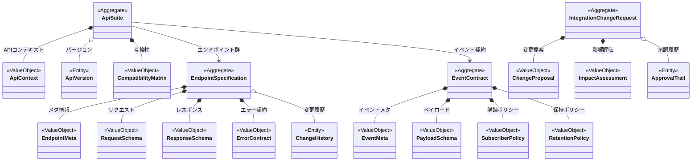

# 統合契約ドメインモデル

## コンテキスト概要
- 目的: 各境界づけられたコンテキスト間の API 契約とイベント契約を管理し、変更の影響を統制する。
- 主な利用者: プラットフォームアーキテクト、API プロダクトオーナー、連携開発チーム。
- 境界づけ: 契約（エンドポイント、ペイロード、バージョン、互換性検証）に限定し、各コンテキスト内部のビジネスロジックは扱わない。

## アグリゲート
### ApiSuite
- 役割: 1 つのコンテキストが公開する API 群の契約を束ね、バージョン管理する。
- 構成要素: `ApiContext` 値オブジェクト、`ApiVersion` エンティティ集合、`CompatibilityMatrix` 値オブジェクト。
- 不変条件: 同一メジャーバージョン内では後方互換性維持／互換性マトリクスは公開済みクライアントとサーバーバージョンの組を管理。
- 関連イベント: `ApiSuiteCreated`, `ApiVersionPublished`, `CompatibilityMatrixUpdated`.

### EndpointSpecification
- 役割: 個々のエンドポイントのメソッド、パス、入力・出力スキーマ、認可要件を定義する。
- 構成要素: `EndpointMeta` 値オブジェクト、`RequestSchema` 値オブジェクト、`ResponseSchema` 値オブジェクト、`ErrorContract` 値オブジェクト、`ChangeHistory` エンティティ集合。
- 不変条件: スキーマは API バージョンと同期し、破壊的変更にはメジャーバージョンの更新が必須／エラーコードは一意。
- 関連イベント: `EndpointDefined`, `EndpointSchemaUpdated`, `EndpointDeprecated`.

### EventContract
- 役割: 非同期ドメインイベントのトピック、ペイロード、発火条件、購読ポリシーを管理する。
- 構成要素: `EventMeta` 値オブジェクト、`PayloadSchema` 値オブジェクト、`SubscriberPolicy` 値オブジェクト、`RetentionPolicy` 値オブジェクト。
- 不変条件: 発火元コンテキストは一意に定義され、イベント名は全システムで衝突不可／購読ポリシーは SLA とリトライ条件を含む。
- 関連イベント: `EventContractRegistered`, `EventSchemaUpdated`, `SubscriberPolicyChanged`.

### IntegrationChangeRequest
- 役割: 契約変更の提案・レビュー・承認フローを管理する。
- 構成要素: `ChangeProposal` 値オブジェクト、`ImpactAssessment` 値オブジェクト、`ApprovalTrail` エンティティ集合。
- 不変条件: 影響評価が完了するまで承認不可／承認フローは利害関係者（公開側・利用側）双方の承認を必要とする。
- 関連イベント: `ChangeRequestSubmitted`, `ImpactAssessmentCompleted`, `ChangeApproved`, `ChangeRejected`.

## エンティティ
- `ApiVersion`: バージョン識別子、ライフサイクルステータス（`DRAFT`, `PUBLISHED`, `DEPRECATED`, `RETIRED`）、公開日、廃止日を保持。
- `ChangeHistory`: 変更者、変更理由、変更内容（差分）、日付を保持。
- `ApprovalTrail`: レビュー担当者、承認結果、コメント、タイムスタンプを保持。

## 値オブジェクト
- `ApiContext`: コンテキスト名、説明、所有チームを内包。
- `CompatibilityMatrix`: サーバーバージョンとクライアントバージョンの互換性情報を内包。
- `EndpointMeta`: HTTP メソッド、パス、説明、認可ロールを内包。
- `RequestSchema`: ペイロード構造、必須項目、検証ルールを内包。
- `ResponseSchema`: レスポンス構造、ステータスコード、例示値を内包。
- `ErrorContract`: エラーコード一覧、意味、再試行可否を内包。
- `EventMeta`: イベント名、発火コンテキスト、トピック名、目的を内包。
- `PayloadSchema`: フィールド構造、型、必須性、例を内包。
- `SubscriberPolicy`: 消費側 SLA、再配信設定、順序保証要件を内包。
- `RetentionPolicy`: イベント保持期間、アーカイブ条件、プライバシーマスク規則を内包。
- `ChangeProposal`: 変更タイプ（追加・修正・廃止・メジャーアップグレード）、対象契約、動機を内包。
- `ImpactAssessment`: 影響を受けるコンテキスト一覧、テスト計画、リリーススケジュールを内包。

## ドメインサービス
- `ContractValidationService`: スキーマ適合性、互換性、命名衝突を検証する。
- `ChangeImpactService`: 変更提案に伴う依存サービス・イベントを解析して影響レポートを生成する。
- `ContractPublicationService`: 承認済み契約をレジストリやドキュメントに公開し、通知イベントを発行する。
- `VersionLifecycleService`: バージョンの昇格・廃止手続きを管理し、利用者への移行期限を定義する。

## ポリシー
- `BackwardCompatibilityPolicy`: 互換性ルール、破壊的変更の許容条件、告知期間を定義。
- `BreakingChangePolicy`: メジャーバージョンアップの承認基準、移行計画策定要件を定義。
- `ContractApprovalPolicy`: レビュー役割、承認閾値、期限超過時の自動処理を定義。
- `DocumentationPolicy`: 契約公開時のドキュメント更新、サンプル提供、翻訳要件を定義。

## ドメインイベント
- `ApiSuiteCreated`, `ApiVersionPublished`, `CompatibilityMatrixUpdated`
- `EndpointDefined`, `EndpointSchemaUpdated`, `EndpointDeprecated`
- `EventContractRegistered`, `EventSchemaUpdated`, `SubscriberPolicyChanged`
- `ChangeRequestSubmitted`, `ImpactAssessmentCompleted`, `ChangeApproved`, `ChangeRejected`
- `ContractPublished`, `VersionRetired`

## リポジトリ
- `ApiSuiteRepository`: コンテキスト別 API スイートとバージョンの永続化、検索。
- `EndpointSpecificationRepository`: エンドポイント契約のバージョン履歴管理。
- `EventContractRepository`: イベント契約と購読設定の保存。
- `IntegrationChangeRequestRepository`: 変更提案、承認履歴、影響評価の保存。

## 外部境界と連携
- 契約公開は API レジストリや開発者ポータルへ配信し、各コンテキストの実装チームが参照する。
- バージョン公開・廃止イベントは `consumer_experience`, `restaurant_operations`, `courier_mobility`, `platform_operations` の開発・運用チームに通知される。
- スキーマ検証は共通スキーマレジストリや CI パイプラインと連携して自動チェックを行う。

## Mermaid クラス図

