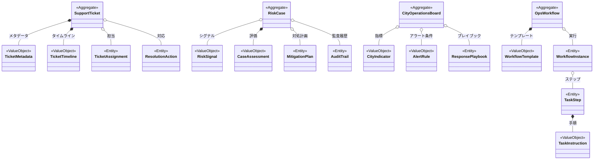

# プラットフォーム運用ドメインモデル

## コンテキスト概要
- 目的: 問い合わせ対応、不正・異常検知、需要供給バランス監視を通じてフードデリバリープラットフォーム全体の安定稼働を実現する。
- 主な利用者: サポート担当者、リスク管理チーム、運用オペレーター、地域マネージャー。
- 境界づけ: 全社的な運用統制にフォーカスし、個別の顧客体験・配達実行・店舗運営の詳細には踏み込まない。

## アグリゲート
### SupportTicket
- 役割: 顧客・店舗・配達員からの問い合わせを一元的に管理する。
- 構成要素: `TicketMetadata` 値オブジェクト、`TicketAssignment` エンティティ、`TicketTimeline` 値オブジェクト、`ResolutionAction` エンティティ集合。
- 不変条件: ステータス遷移は `NEW` → `IN_PROGRESS` → `RESOLVED` / `CLOSED` / `ESCALATED`／優先度変更は根拠を伴う。
- 関連イベント: `TicketCreated`, `TicketAssigned`, `TicketStatusUpdated`, `TicketResolved`, `TicketEscalated`.

### RiskCase
- 役割: 不正利用や問題のある注文を検知し、対処ワークフローを進行管理する。
- 構成要素: `RiskSignal` 値オブジェクト集合、`CaseAssessment` 値オブジェクト、`MitigationPlan` エンティティ、`AuditTrail` エンティティ集合。
- 不変条件: リスクレベルに応じた SLA を保持／対処プランは担当者と実行ステップを必ず持つ／監査ログの改ざん禁止。
- 関連イベント: `RiskDetected`, `RiskAssessed`, `MitigationStarted`, `MitigationCompleted`, `CaseClosed`.

### CityOperationsBoard
- 役割: 都市別の需要供給指標、配達員稼働、注文量、 SLA を可視化する。
- 構成要素: `CityIndicator` 値オブジェクト集合、`AlertRule` 値オブジェクト集合、`ResponsePlaybook` エンティティ。
- 不変条件: 指標はタイムスライスごとに整合性を保持／アラート閾値は都市ごとの設定に従う／発火したアラートに対しては必ずレスポンスアクションか記録が必要。
- 関連イベント: `IndicatorUpdated`, `AlertTriggered`, `ResponsePlanExecuted`.

### OpsWorkflow
- 役割: サポート・リスク・モニタリングに共通する手続をテンプレート化し、実行状況を管理する。
- 構成要素: `WorkflowTemplate` 値オブジェクト、`WorkflowInstance` エンティティ、`TaskStep` エンティティ集合。
- 不変条件: テンプレートはバージョン管理され、進行中インスタンスは改変不可／各ステップは責任者と期限を持つ。
- 関連イベント: `WorkflowInitiated`, `TaskStepCompleted`, `WorkflowCompleted`.

## エンティティ
- `TicketAssignment`: 担当者、キュー、割当時刻、再割当履歴を保持。
- `ResolutionAction`: 対応内容、発生時刻、成果、関連外部リファレンスを保持。
- `MitigationPlan`: 対応ステップ、必要リソース、完了状況を保持。
- `AuditTrail`: 操作ユーザー、内容、タイムスタンプ、証跡を保持。
- `ResponsePlaybook`: アラート種別別の推奨アクション、連絡先、承認フローを保持。
- `WorkflowInstance`: 実行中テンプレートの識別子、開始時刻、完了状況、関連チケットやケース参照を保持。
- `TaskStep`: ステップ順序、担当者、期限、成果物リンクを保持。

## 値オブジェクト
- `TicketMetadata`: 申請者、カテゴリ、優先度、発生源を内包。
- `TicketTimeline`: ステータス履歴、コメント履歴、 SLA 計測値を内包。
- `RiskSignal`: 検知ルール、スコア、発生元、対象IDを内包。
- `CaseAssessment`: リスク評価結果、推奨対策、承認者情報を内包。
- `CityIndicator`: 指標名、値、閾値、比較期間、信頼度を内包。
- `AlertRule`: 条件式、閾値、モニタリング区間、通知先を内包。
- `WorkflowTemplate`: 手順一覧、役割、想定所要時間を内包。
- `TaskInstruction`: 各ステップの実行ガイド、チェックリストを内包（`TaskStep` と組で利用）。

## ドメインサービス
- `TicketRoutingService`: 問い合わせカテゴリと負荷バランスから適切な担当者やキューへ割り当てる。
- `RiskScoringService`: 検知シグナルを集約し、リスクレベルを算出して `RiskCase` を更新する。
- `AlertEvaluationService`: 都市指標の更新時に閾値判定を行い、必要に応じてアラートを発火する。
- `WorkflowOrchestrator`: サポートチーム・リスクチーム横断の手続きをテンプレートに沿って進行させる。
- `OpsReportingService`: 対応実績、 SLA 達成度、リスク処理状況を集計し、運用指標を提供する。

## ポリシー
- `TicketSlaPolicy`: チケット種別ごとの応答時間・解決時間 SLA とエスカレーション条件を定義。
- `RiskEscalationPolicy`: リスクスコアに応じたエスカレーション先とアカウント停止条件を定義。
- `AlertThrottlePolicy`: 過剰なアラート発火を抑制し、一定時間内の通知頻度を制御する。
- `WorkflowCompliancePolicy`: 手順スキップや期日超過時の対応策、承認フローを定義。
- `DataRetentionPolicy`: チケット・リスク・メトリクスデータの保存期間とマスキング要件を定義。

## ドメインイベント
- `TicketCreated`, `TicketAssigned`, `TicketStatusUpdated`, `TicketResolved`, `TicketEscalated`
- `RiskDetected`, `RiskAssessed`, `MitigationStarted`, `MitigationCompleted`, `CaseClosed`
- `IndicatorUpdated`, `AlertTriggered`, `ResponsePlanExecuted`
- `WorkflowInitiated`, `TaskStepCompleted`, `WorkflowCompleted`
- `SlaBreached`, `OpsReportGenerated`

## リポジトリ
- `SupportTicketRepository`: チケットの検索・更新、SLA 計測、履歴参照。
- `RiskCaseRepository`: リスクケースの保存、シグナル追跡、対処状況の永続化。
- `CityOperationsBoardRepository`: 都市指標とアラート設定の保存、履歴管理。
- `OpsWorkflowRepository`: テンプレートのバージョン管理、インスタンスの進行状態管理。

## 外部境界と連携
- `integration_contract` の Operations API を通じてチケット管理、リスク検知、都市指標モニタリングを提供する。
- チケット・リスク情報は `consumer_experience`, `restaurant_operations`, `courier_mobility` からのイベントで生成され、対応結果はそれぞれへ通知する。
- 都市指標のデータソースとして配送データ、注文データ、配達員稼働データを取り込み、必要に応じて `courier_mobility` へ追加配達員募集のリクエストを送信する。
- レポートは経営層や外部監査向けに提供され、`platform_operations` 内部のガバナンスプロセスに活用される。

## Mermaid クラス図

