# レストランオペレーションドメインモデル

## コンテキスト概要
- 目的: レストランが営業時間や配達エリア、メニューを自主的に管理し、注文処理と分析を通じて事業を最適化できるようにする。
- 主な利用者: レストランパートナー、店舗スタッフ、店舗管理者。
- 境界づけ: 店舗内部のオペレーションに焦点を当て、消費者体験や配達運行は他コンテキストに委任する。

## アグリゲート
### RestaurantAccount
- 役割: 店舗の基本情報、営業時間設定、配達エリア設定、通知先を一貫して保持する。
- 構成要素: `OperatingHours` 値オブジェクト集合、`DeliveryZone` 値オブジェクト集合、`FulfillmentCapability` 値オブジェクト、`NotificationChannel` エンティティ集合。
- 不変条件: 営業時間は曜日・祝日ごとの一貫性を保ち、営業時間の重複を禁止／配達エリアは地理的な多角形として互いに重複許容を定義／店舗がクローズ状態の時間帯には注文受諾不可。
- 関連イベント: `OperatingHoursUpdated`, `DeliveryZoneUpdated`, `RestaurantTemporarilyClosed`.

### MenuCatalog
- 役割: メニュー項目とカテゴリ、価格、説明、画像を管理し、公開ステータスを制御する。
- 構成要素: `MenuCategory` エンティティ集合、`MenuItem` エンティティ集合、`MenuVersion` 値オブジェクト。
- 不変条件: 同一カテゴリ内の表示順序はユニーク／公開中のメニューは必ず価格と在庫ステータスが有効／下書きの変更は公開操作で初めて外部に反映。
- 関連イベント: `MenuItemCreated`, `MenuItemUpdated`, `MenuItemArchived`, `MenuPublished`.

### OrderBoard
- 役割: 新規注文と変更依頼をリアルタイムに受け付け、調理・出荷プロセスのステータス管理を行う。
- 構成要素: `OrderTicket` エンティティ集合、`PreparationQueue` 値オブジェクト、`ChangeDirective` エンティティ。
- 不変条件: 各 `OrderTicket` のステータスは `PENDING` → `ACKNOWLEDGED` → `PREPARING` → `READY_FOR_PICKUP` → `HANDED_OVER`／変更依頼は承認・却下の結果が反映されるまで本体に影響を与えない。
- 関連イベント: `OrderAcknowledged`, `PreparationStageUpdated`, `OrderChangeResponded`, `OrderReadyForPickup`, `OrderHandedOver`.

### RevenueLedger
- 役割: 売上・キャンセル率・人気商品などの分析指標を集約し、レポート出力を行う。
- 構成要素: `SalesMetric` 値オブジェクト集合、`TrendSnapshot` 値オブジェクト、`ExportSchedule` 値オブジェクト。
- 不変条件: 集計期間ごとにダブルカウントが発生しないように記録／キャンセル売上は `OrderBoard` の結果と整合する。
- 関連イベント: `SalesMetricsUpdated`, `AnalyticsExportScheduled`.

## エンティティ
- `NotificationChannel`: メール、SMS、ダッシュボード等の通知宛先と優先度を保持。
- `MenuCategory`: カテゴリ名、表示順序、公開状態を保持。
- `MenuItem`: 商品名、説明、価格、画像URL、在庫状態、アレルゲン情報を保持。
- `OrderTicket`: 注文ID、明細、受領時刻、優先度、ステータス遷移履歴を保持。
- `ChangeDirective`: 変更依頼内容、店舗判断、結果通知先を保持。

## 値オブジェクト
- `OperatingHours`: 曜日と開始終了時刻、特別休業日を内包。
- `DeliveryZone`: 地理的境界、多店舗との重複許容設定、料金調整を内包。
- `FulfillmentCapability`: 対応可能な注文量、平均調理時間、同時注文処理数を内包。
- `MenuVersion`: バージョン番号、公開日時、作成者を内包。
- `PreparationQueue`: 現在のキューサイズ、待機時間指標、優先度ルールを内包。
- `SalesMetric`: 集計指標名、値、比較対象期間、単位を内包。
- `TrendSnapshot`: 期間内の売上推移、人気商品ランキング、キャンセル率傾向を内包。
- `ExportSchedule`: エクスポート種別、出力形式、出力先を内包。

## ドメインサービス
- `MenuPublishingService`: 下書きメニューのバリデーションと公開処理を担い、`MenuCatalog` を更新する。
- `OrderRoutingService`: 新規注文の優先順位や調理ラインへの割り付けを決定し `OrderBoard` に反映する。
- `ChangeRequestService`: `consumer_experience` からの変更／キャンセル依頼を評価し、可否判定を行う。
- `AnalyticsAggregationService`: 注文履歴と売上データを集計し `RevenueLedger` を更新する。
- `OperationalAlertService`: 調理負荷や設備障害などのアラートを検知し、営業時間変更や受付一時停止を `RestaurantAccount` に反映する。

## ポリシー
- `AvailabilityPolicy`: 原材料不足やピーク負荷時に受付休止を発動する条件を定義。
- `MenuVersioningPolicy`: 公開済みメニューの修正手順や承認フローを定義。
- `OrderAcceptancePolicy`: 注文受諾の SLA、拒否理由、再通知条件を定義。
- `ChangeWindowPolicy`: 注文受諾後に変更を受け付ける時間窓と対応可能条件を定義。
- `AnalyticsRetentionPolicy`: 分析データの保持期間と匿名化要件を定義。

## ドメインイベント
- `OperatingHoursUpdated`, `DeliveryZoneUpdated`, `RestaurantTemporarilyClosed`
- `MenuItemCreated`, `MenuItemUpdated`, `MenuItemArchived`, `MenuPublished`
- `OrderAcknowledged`, `PreparationStageUpdated`, `OrderChangeResponded`, `OrderReadyForPickup`, `OrderHandedOver`
- `SalesMetricsUpdated`, `AnalyticsExportScheduled`
- `OrderRejected`, `KitchenOverloaded`（稼働状況アラート）

## リポジトリ
- `RestaurantAccountRepository`: 店舗設定の読み書き、営業時間履歴管理。
- `MenuCatalogRepository`: メニューとカテゴリのバージョン管理、公開ステータスの更新。
- `OrderBoardRepository`: 注文チケットの取得・更新、変更依頼の管理。
- `RevenueLedgerRepository`: 指標集計の保存、レポート出力履歴の管理。

## 外部境界と連携
- `integration_contract` の Restaurant API を通じて設定更新、メニュー管理、注文取得、ステータス更新、分析データ提供を行う。
- 注文や変更依頼は `consumer_experience` からのイベント・API コールで受信し、結果を同コンテキストへ返却する。
- 調理完了や引き渡し情報は `courier_mobility` に通知して配達プロセスを連携する。
- 売上データや店舗ステータスは `platform_operations` の監視対象として提供される。

## Mermaid クラス図

```mermaid
classDiagram
  direction TB
  class RestaurantAccount {
    <<Aggregate>>
  }
  class MenuCatalog {
    <<Aggregate>>
  }
  class OrderBoard {
    <<Aggregate>>
  }
  class RevenueLedger {
    <<Aggregate>>
  }
  class NotificationChannel {
    <<Entity>>
  }
  class MenuCategory {
    <<Entity>>
  }
  class MenuItem {
    <<Entity>>
  }
  class OrderTicket {
    <<Entity>>
  }
  class ChangeDirective {
    <<Entity>>
  }
  class OperatingHours {
    <<ValueObject>>
  }
  class DeliveryZone {
    <<ValueObject>>
  }
  class FulfillmentCapability {
    <<ValueObject>>
  }
  class MenuVersion {
    <<ValueObject>>
  }
  class PreparationQueue {
    <<ValueObject>>
  }
  class SalesMetric {
    <<ValueObject>>
  }
  class TrendSnapshot {
    <<ValueObject>>
  }
  class ExportSchedule {
    <<ValueObject>>
  }
  RestaurantAccount o-- NotificationChannel : 通知先
  RestaurantAccount *-- OperatingHours : 営業時間
  RestaurantAccount o-- DeliveryZone : 配達エリア
  RestaurantAccount *-- FulfillmentCapability : 調理能力
  MenuCatalog o-- MenuCategory : カテゴリ
  MenuCatalog o-- MenuItem : メニュー
  MenuCatalog *-- MenuVersion : バージョン
  OrderBoard o-- OrderTicket : 注文チケット
  OrderBoard *-- PreparationQueue : 調理キュー
  OrderBoard o-- ChangeDirective : 変更指示
  RevenueLedger o-- SalesMetric : 指標
  RevenueLedger o-- TrendSnapshot : 傾向
  RevenueLedger *-- ExportSchedule : 出力設定
```

